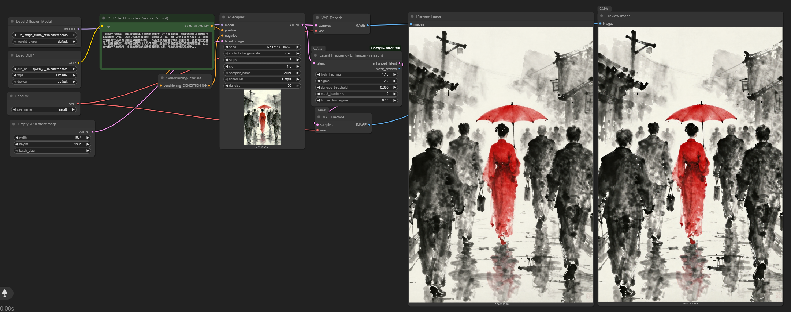

# Latent Utils for ComfyUI

  
*Example output showing original (left) and enhanced image (right)* 

*high_freq_mult: 2 is an extreme value to show the difference (demo only).*

  

## 🌟 Overview
This custom ComfyUI node performs **selective latent denoising and detail enhancement** using Fourier Transform (FFT) techniques. It intelligently separates image frequencies to:
- Preserve and enhance important high-frequency details
- Suppress background noise and artifacts
- Output a visual preview of the processing mask

Ideal for refining AI-generated images while maintaining sharp features and eliminating graininess.

Supports models:
- Wan vae (Qwen, etc)
- Flux vae (ZImageTurbo, Flux1.dev, etc)
- Other models not tested

---

## ⚙️ Installation
1. Navigate to your ComfyUI custom nodes directory:
   `cd ComfyUI/custom_nodes`
2. Clone this repository:
   `git clone https://github.com/lrzjason/comfyui-latent-frequency-enhancer.git`
3. Restart ComfyUI
4. Find the node under: `latent → enhancement → Latent Frequency Enhancer (lrzjason)`

---

## 🎚️ Parameters Explained
| Parameter | Default | Range | Description |
|-----------|---------|-------|-------------|
| **Detail Strength (HF Mult)** | 1.15 | 1.0-2.0 | Multiplier for high-frequency details (values >1 enhance details) |
| **Frequency Split Sigma** | 2.0 | 0.1-20.0 | Controls frequency separation sharpness (higher = more low frequencies preserved) |
| **Noise Threshold** | 0.05 | 0.0-1.0 | Minimum magnitude to preserve details (higher = more aggressive denoising) |
| **Mask Hardness** | 2.0 | 1.0-100.0 | Transition sharpness in noise suppression (higher = sharper cutoff) |
| **Noise Grouping (Pre-Blur)** | 0.5 | 0.0-1.0 | Pre-blur strength for noise coherence (0.0 disables) |

---

## 🔬 How It Works
1. **Frequency Separation**  
   Uses FFT to split latent into:
   - **Low frequencies**: Base composition and smooth areas
   - **High frequencies**: Details, textures, and noise

2. **Smart Mask Generation**  
   Creates a dynamic mask using:
   - Sigmoid soft-gating function
   - Adjustable noise threshold
   - Pre-blur for noise coherence
   
3. **Selective Enhancement**  
   - Boosts important high-frequency details
   - Suppresses noise below threshold
   - Smoothly blends components using frequency-aware masking

4. **Visual Feedback**  
   Outputs a mask preview showing:
   - **White areas**: Preserved/enhanced details
   - **Black areas**: Suppressed noise
   - **Gray transitions**: Smooth blending zones

---

## 🖼️ Output Preview
The node outputs two items:
1. **Enhanced Latent** (`enhanced_latent`)  
   The processed latent ready for decoding
   
2. **Mask Preview** (`mask_preview`)  
   Visual representation of the processing mask

---

## 💡 Pro Tips
1. **Start with defaults** for most images, then adjust:
   - Increase `Detail Strength` for sharper outputs
   - Raise `Noise Threshold` for noisy generations
   - Lower `Frequency Split Sigma` for cartoon/anime styles

2. **Mask interpretation**:
   - If mask shows important details as black → Lower noise threshold
   - If noise remains visible → Increase mask hardness
   - For soft-focus effects → Increase pre-blur sigma

3. **Combine with other nodes**:
   - Use after KSampler but before VAEDecode
   - Chain with ControlNet for detail preservation
   - Follow with Color Correct nodes for final polish

---

## 📜 Technical Notes
- **WAN Format Compatible**: Automatically handles WAN-style latent tensors
- **Memory Efficient**: Processes entirely on GPU when available
- **Deterministic**: Uses stable FFT operations with no random elements

---

## 🙏 Credits
- FFT implementation inspired by academic frequency-domain processing papers
- Sigmoid gating adapted from noise2noise research
- ComfyUI node template by [ComfyOrg](https://github.com/comfyanonymous/ComfyUI)

> **Note**: This is a research-grade implementation. Results may vary based on model and generation parameters. Always validate outputs visually.

  
*For research and personal use only. Not for commercial deployment without permission.*