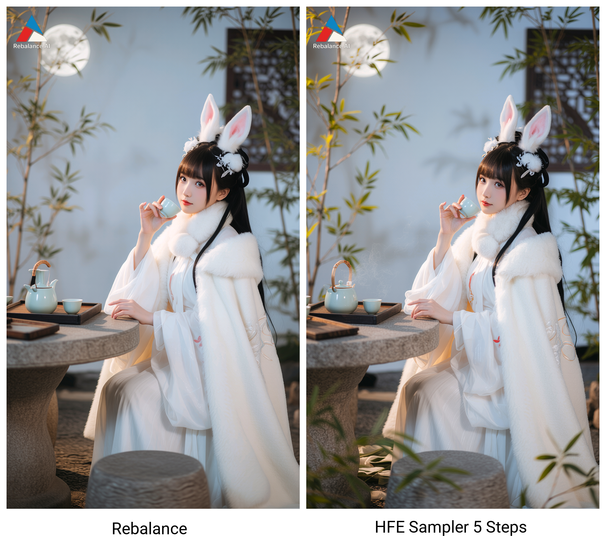

# Latent Utils for ComfyUI

  
*Example output showing original (left) and enhanced image (right)* 

*high_freq_mult: 2 is an extreme value to show the difference (demo only).*

  

## 🌟 Overview
This custom ComfyUI node performs **selective latent denoising and detail enhancement** using Fourier Transform (FFT) techniques. It intelligently separates image frequencies to:
- Preserve and enhance important high-frequency details
- Suppress background noise and artifacts
- Output a visual preview of the processing mask

Ideal for refining AI-generated images while maintaining sharp features and eliminating graininess.

Supports models:
- Wan vae (Qwen, etc)
- Flux vae (ZImageTurbo, Flux1.dev, etc)
- Other models not tested

---

## ⚙️ Installation
1. Navigate to your ComfyUI custom nodes directory:
   `cd ComfyUI/custom_nodes`
2. Clone this repository:
   `git clone https://github.com/lrzjason/comfyui-latent-frequency-enhancer.git`
3. Restart ComfyUI
4. Find the nodes under:
   - `latent → enhancement → Latent Frequency Enhancer (lrzjason)`
   - `sampling → HFEPostProcessor (lrzjason)`

---

## 🔬 How It Works
1. **Frequency Separation**
   Uses FFT to split latent into:
   - **Low frequencies**: Base composition and smooth areas
   - **High frequencies**: Details, textures, and noise

2. **Smart Mask Generation**
   Creates a dynamic mask using:
   - Sigmoid soft-gating function
   - Adjustable noise threshold
   - Pre-blur for noise coherence

3. **Selective Enhancement**
   - Boosts important high-frequency details
   - Suppresses noise below threshold
   - Smoothly blends components using frequency-aware masking

4. **Visual Feedback**
   Outputs a mask preview showing:
   - **White areas**: Preserved/enhanced details
   - **Black areas**: Suppressed noise
   - **Gray transitions**: Smooth blending zones

## 🚀 HFEPostProcessor: In-Process Enhancement
The **HFEPostProcessor** node applies high-frequency enhancement during the sampling process rather than after it. This approach:
- Applies enhancement at specific sampling steps (after basic sampling)
- Integrates frequency enhancement directly into the generation pipeline
- Allows for more refined control by specifying which steps to enhance
- Works as a sampler replacement that combines sampling with enhancement

---

  
  

## 🎚️ Parameters Explained
### Latent Frequency Enhancer Node
| Parameter | Default | Range | Description |
|-----------|---------|-------|-------------|
| **Detail Strength (HF Mult)** | 1.15 | 1.0-2.0 | Multiplier for high-frequency details (values >1 enhance details) |
| **Frequency Split Sigma** | 2.0 | 0.1-20.0 | Controls frequency separation sharpness (higher = more low frequencies preserved) |
| **Noise Threshold** | 0.05 | 0.0-1.0 | Minimum magnitude to preserve details (higher = more aggressive denoising) |
| **Mask Hardness** | 2.0 | 1.0-100.0 | Transition sharpness in noise suppression (higher = sharper cutoff) |
| **Noise Grouping (Pre-Blur)** | 0.5 | 0.0-1.0 | Pre-blur strength for noise coherence (0.0 disables) |

### HFEPostProcessor Node
| Parameter | Default | Range | Description |
|-----------|---------|-------|-------------|
| **Model** | - | - | The diffusion model to use for sampling |
| **Steps** | 8 | 1-10000 | Total number of sampled steps |
| **HFE Steps** | 2 | 1-100 | Number of steps to apply high-frequency enhancement |
| **Latent Image** | - | - | The latent image to enhance |
| **Noise Seed** | 0 | 0-18446744073709551615 | Random seed for noise generation |
| **CFG Scale** | 1.0 | 0.0-100.0 | Classifier-free guidance scale |
| **Sampler Name** | - | Various | Name of the sampler to use |
| **Scheduler** | - | Various | Scheduler to use for sampling |
| **Positive** | - | - | Positive conditioning |
| **Negative** | - | - | Negative conditioning |
| **Detail Strength (HF Mult)** | 1.05 | 1.0-2.0 | Multiplier for high-frequency details during enhancement |
| **Frequency Split Sigma** | 5.0 | 0.01-20.0 | Controls frequency separation during enhancement |
| **Noise Threshold** | 0.05 | 0.0-1.0 | Minimum magnitude to preserve details during enhancement |
| **Mask Hardness** | 2.0 | 0.01-100.0 | Transition sharpness in noise suppression during enhancement |
| **Noise Grouping (Pre-Blur)** | 0.5 | 0.0-1.0 | Pre-blur strength for noise coherence during enhancement |

---

## 🖼️ Output Preview
The Latent Frequency Enhancer node outputs two items:
1. **Enhanced Latent** (`enhanced_latent`)
   The processed latent ready for decoding

2. **Mask Preview** (`mask_preview`)
   Visual representation of the processing mask

The HFEPostProcessor node outputs one item:
1. **Enhanced Latent** (`LATENT`)
   The final processed latent after both sampling and enhancement

---

## 💡 Pro Tips
### For Latent Frequency Enhancer Node:
1. **Start with defaults** for most images, then adjust:
   - Increase `Detail Strength` for sharper outputs
   - Raise `Noise Threshold` for noisy generations
   - Lower `Frequency Split Sigma` for cartoon/anime styles

2. **Mask interpretation**:
   - If mask shows important details as black → Lower noise threshold
   - If noise remains visible → Increase mask hardness
   - For soft-focus effects → Increase pre-blur sigma

3. **Combine with other nodes**:
   - Use after KSampler but before VAEDecode
   - Chain with ControlNet for detail preservation
   - Follow with Color Correct nodes for final polish

### For HFEPostProcessor Node:
1. **Integration with sampling**:
   - The `Steps` parameter should match your basic sampling steps
   - Use `HFE Steps` to specify how many steps to apply high-frequency enhancement
   - Start with fewer HFE steps (2-4) and adjust as needed

2. **Parameter adjustments**:
   - Use lower `Detail Strength` values (1.05-1.15) compared to post-process mode
   - Higher `Frequency Split Sigma` (5.0+) may work better during sampling
   - The enhancement happens mid-generation, so parameters may differ from post-processing

3. **Workflow integration**:
   - Replace standard samplers with HFEPostProcessor to combine sampling and enhancement
   - The node handles both sampling and enhancement in one step
   - Use when you want the enhancement to influence the remaining sampling steps

---

## 📜 Technical Notes
### For Latent Frequency Enhancer Node:
- **WAN Format Compatible**: Automatically handles WAN-style latent tensors
- **Memory Efficient**: Processes entirely on GPU when available
- **Deterministic**: Uses stable FFT operations with no random elements

### For HFEPostProcessor Node:
- **Integrated Sampling**: Combines sampling and enhancement in one node
- **Step Control**: Allows specifying when during sampling enhancement begins
- **Compatible**: Works with all standard ComfyUI samplers and schedulers
- **Efficient**: Applies enhancement only at specified steps for optimal performance

---

## 🙏 Credits
- FFT implementation inspired by academic frequency-domain processing papers
- Sigmoid gating adapted from noise2noise research
- ComfyUI node template by [ComfyOrg](https://github.com/comfyanonymous/ComfyUI)

> **Note**: This is a research-grade implementation. Results may vary based on model and generation parameters. Always validate outputs visually.

  
*For research and personal use only. Not for commercial deployment without permission.*

## Contact
- **Twitter**: [@Lrzjason](https://twitter.com/Lrzjason)  
- **Email**: lrzjason@gmail.com  
- **QQ Group**: 866612947  
- **Wechatid**: fkdeai
- **Civitai**: [xiaozhijason](https://civitai.com/user/xiaozhijason)

## Sponsors me for more open source projects:

  <table>
    <tr>
      <td align="center">
        
Buy me a coffee:

        
      </td>
      <td align="center">
        
WeChat:

        
      </td>
    </tr>
  </table>

